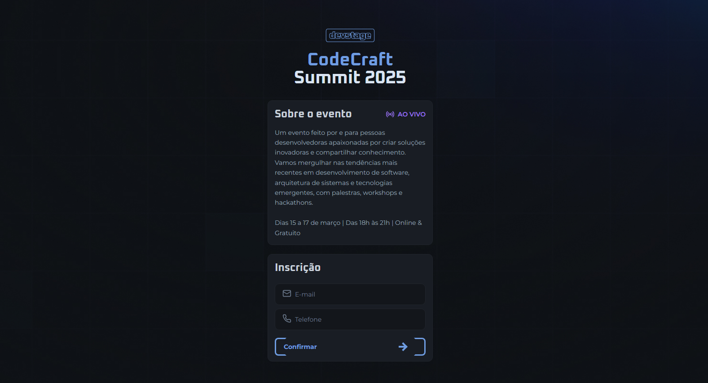
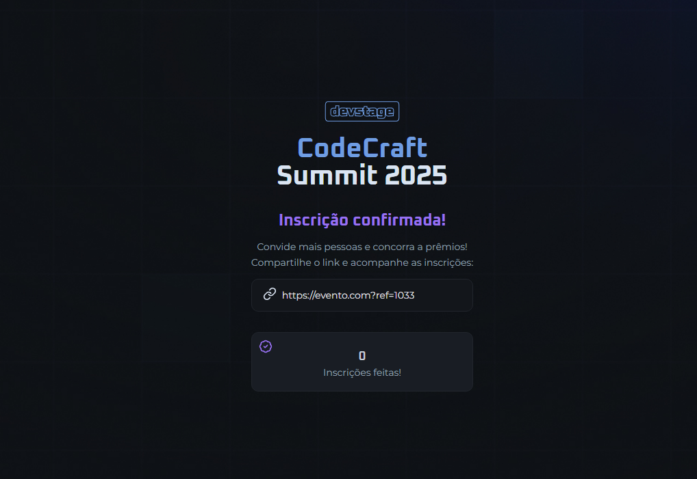

# 19º NLW Conect - Trilha Fullstack

## 🔍 Visão geral

O NLW Connect - Fullstack da Rocketseat foi projeto onde desenvolvi o DevStage, um site responsivo de inscrição e indicação para eventos, aplicando conceitos fundamentais de HTML, CSS e JavaScript para criar uma interface moderna e interativa.

## 👨🏻‍💻 Tecnologias

- HTML 
- CSS 
- JavaScript 
- Figma 

## :rocket: Sobre o desenvolvimento

Ao desenvolver esse projeto, coloquei em prática aprendizados recentes sobre JavaScript e CSS, aplicando conceitos como:

✅Estruturação semântica com HTML, garantindo acessibilidade e organização do código.

✅ Estilização avançada com CSS, utilizando variáveis, responsividade e efeitos visuais para uma melhor experiência do usuário.

✅ Criação de um formulário interativo, permitindo que os usuários façam suas inscrições com validação de campos.

✅ Manipulação do DOM com JavaScript, tornando a página dinâmica e responsiva a interações.

✅ Feedback visual para o usuário, como botões interativos e mensagens de confirmação.

✅ Uso de ícones e elementos gráficos, melhorando a estética e usabilidade do site.

 

---

**1 - Tela da aplicação onde o usuário faz a inscrição para o evento**

 

---

**2 - Tela onde o usuário recebe a confirmação de inscrição e o link de referência para indiccar outras pessoas e o número de inscrições.**

